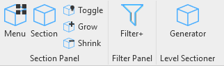
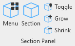
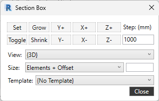
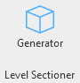
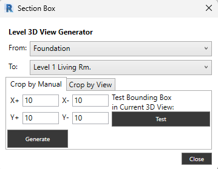

# Orion
A revit addin with general tools to help productivity. Currently in-development.

## Features
1. Better Section Box (90% Complete)
2. Filter Plus (10% Complete)
3. Level Sectioner (100% Complete)
4. Better Project Browser (*Planned*)
5. Group Level Fixer (*Planned*)

## Descriptions

**1. Better Section Box**

A menu that gives you more control over 3D Section box.

**2. Level Sectioner**

A feature that automates the creation of a 3d view with a section box set between two levels. From Level 1 to Level 6, it creates a 3d for each step, e.g. (L1 to L2, L2 to L3, ... L5 to L6).

